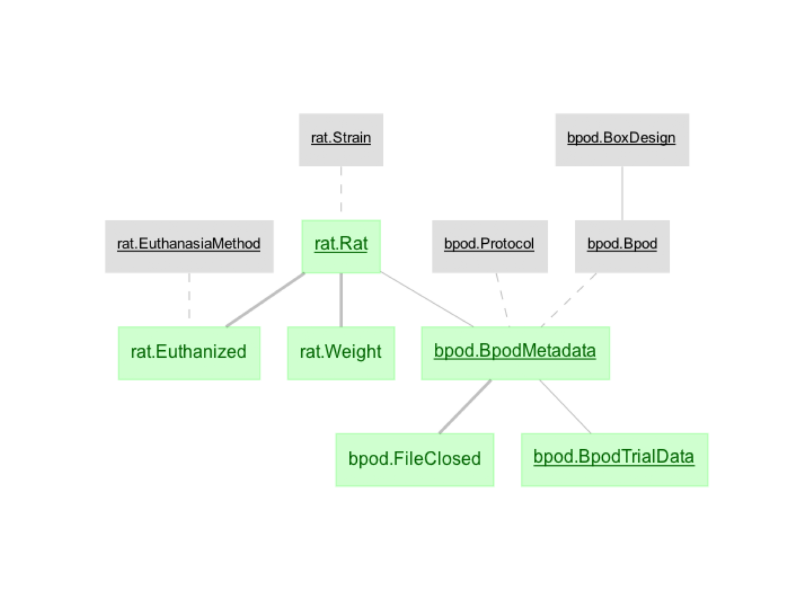

# dj_ratacad: Datajoint for the Scott Lab Ratacademy

Python package for the Scott Lab Rat Academy datajoint pipeline. This package contains datajoint schema/table definitions, some utility functions, and command-line scripts.

### Requirements

- Python 3: Perferably using [Anaconda](https://www.anaconda.com/products/individual) or a virtual environment

### Installation (terminal commands)

1. (Recommended) Set up a new conda environment and activate it:

```
conda create -n dj python=3.7
conda activate dj
```

2. Install the dj_ratacad package (will install all dependencies, including datajoint):

```
pip install git+https://github.com/RatAcad/dj_ratacad
```

Or for development:

```
git clone https://github.com/RatAcad/dj_ratacad
cd dj_ratacad
pip install -e .
```

3. Create your datajoint configuration. Please see datajoint documentation on [setting the datajoint config object](https://docs.datajoint.io/python/setup/01-Install-and-Connect.html)

### Pushing Data From Rat Academy Control Computers

Stay tuned...

### Querying Data

For general information on querying data from python-datajoint databases, please see [datajoint's documentation](https://docs.datajoint.io/python/queries/Queries.html).

This pipeline is designed around Bpod Trials (in the bpod.BpodTrialData table). All important information about an Bpod Trial is connected to the bpod.BpodTrialData table, including the rat, the box this rat was in and the box configuration, the protocol used, the time of the trial, etc. For more details, please see the [bpod schema definition](dj_ratacad/bpod.py), and the datajoint ERD diagram below. Further analyses that are specific to a particular task can be found in additional task-specific schema (e.g. see the [flashes task schema](dj_ratacad/flashes), which consolidates important information for each flashes task trial from the bpod.BpodTrialData table).



#### Example Queries

To query all trial data from the flashes task as a list of dictionaries (a dictionary for each trial):

```
from dj_ratacad import flashes
flashes.FlashesTrial().fetch(as_dict=True)
```

To query only data from the rat "Ron": `(flashes.FlashesTrial() & 'name="Ron"').fetch(as_dict=True)`

To query only data from the final stage of training (stage 5):`(flashes.FlashesTrial() & 'stage=5').fetch(as_dict=True)`
